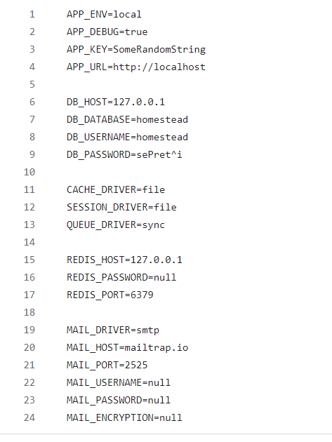

# DEPLOYING PHP-FRAME WORK(LARAVAL) MAUALLY USING VAGRANT FOR INFRASTRUCTURE DEPLOYMENT

## Installing and Deploying DB

DATABASE_PASS='admin123'

```markdown
sudo yum update -y
sudo yum install epel-release -y
sudo yum install git zip unzip -y
sudo yum install mariadb-server -y
```

**#starting & enabling mariadb-server**

```markdown
sudo systemctl start mariadb
sudo systemctl enable mariadb
```

#restore the dump file for the application

```markdown
sudo mysqladmin -u root password "$DATABASE_PASS"
sudo mysql -u root -p"$DATABASE_PASS" -e "DELETE FROM mysql.user WHERE User='root' AND Host NOT IN ('localhost', '127.0.0.1', '::1')"
sudo mysql -u root -p"$DATABASE_PASS" -e "DELETE FROM mysql.user WHERE User=''"
sudo mysql -u root -p"$DATABASE_PASS" -e "DELETE FROM mysql.db WHERE Db='test' OR Db='test\_%'"
sudo mysql -u root -p"$DATABASE_PASS" -e "FLUSH PRIVILEGES"
sudo mysql -u root -p"$DATABASE_PASS" -e "create database homestead"
sudo mysql -u root -p"$DATABASE_PASS" -e "create user'homestead'@'%' identified by 'admin123';"
sudo mysql -u root -p"$DATABASE_PASS" -e "grant all privileges on homestead.* TO 'homestead'@'%' identified by 'admin123'"
sudo mysql -u root -p"$DATABASE_PASS" -e "FLUSH PRIVILEGES"
```

**#Restart mariadb-server**

```markdown
sudo systemctl restart mariadb
```

**#starting the firewall and allowing the mariadb to access from port no. 3306**

```markdown
sudo systemctl start firewalld
sudo systemctl enable firewalld
sudo firewall-cmd --get-active-zones
sudo firewall-cmd --zone=public --add-port=3306/tcp --permanent
sudo firewall-cmd --reload
sudo systemctl restart mariadb
```

## Installing and Configuring the application server:

Note that the php version used is 7.4 or less, else you will experience compactibility error.

DATABASE_PASS='admin123'

```markdown
sudo yum update -y

yum install epel-release -y

sudo dnf module reset php

sudo dnf install -y https://rpms.remirepo.net/enterprise/remi-release-8.rpm
sudo dnf module reset php
sudo dnf module enable php:remi-7.4
sudo dnf install php php-cli php-fpm

sudo dnf install -y php-opcache php-gd php-curl php-mysqlnd git

sudo systemctl start php-fpm

sudo systemctl enable php-fpm

sudo setsebool -P httpd_execmem 1

git clone https://github.com/nbomasi/php-todo.git

sudo yum install httpd -y

sudo systemctl restart httpd

sudo systemctl status httpd

sudo setenforce 0 
```

# For client db:

```markdown
yum install mariadb-server -y

cp -R php-todo/. /var/www/html

cd /var/www/html

#Rename .env.sample to .env

mv .env.sample .env

vi .env
```




```markdown
sudo systemctl restart httpd 
```

## The following step will Take us through php composer, which is a php package manager.**

```markdown
1. php -r "copy('https://getcomposer.org/installer', 'composer-setup.php');"
php -r "if (hash_file('sha384', 'composer-setup.php') === 'e21205b207c3ff031906575712edab6f13eb0b361f2085f1f1237b7126d785e826a450292b6cfd1d64d92e6563bbde02') { echo 'Installer verified'; } else { echo 'Installer corrupt'; unlink('composer-setup.php'); } echo PHP_EOL;"
php composer-setup.php
php -r "unlink('composer-setup.php');"
```

Run the following command to be able to run composer command from any directory.

```markdown
2. sudo mv composer.phar /usr/local/bin/composer

3. composer install

4. php artisan migrate

4. php artisan serve  --host=0.0.0.0
```

Then on your browser open the following url http://192.168.56.14:8000, the following page will display

